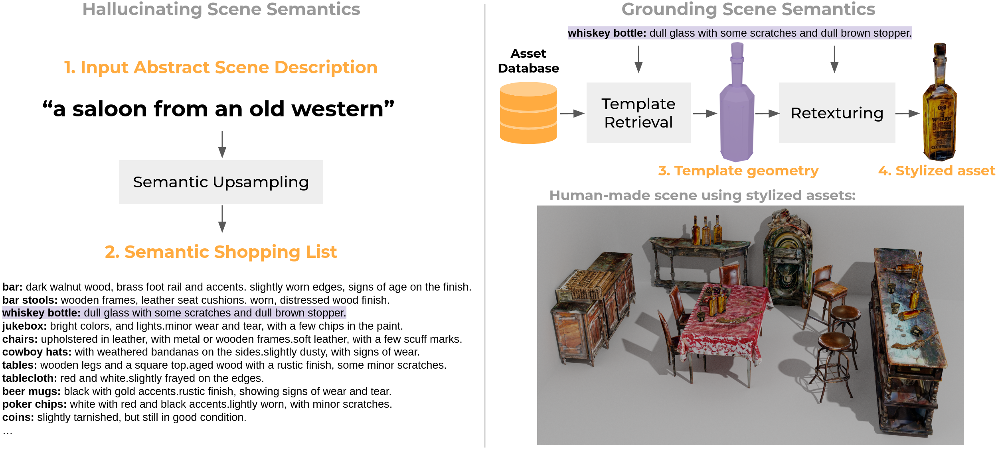
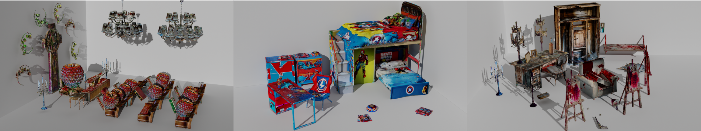

#  Aladdin: Zero-Shot Hallucination of Stylized 3D Assets from Abstract Scene Descriptions


**Aladdin: Zero-Shot Hallucination of Stylized 3D Assets from Abstract Scene Descriptions**

Ian Huang, Vrishab Krishna, Omoruyi Atekha, Leonidas Guibas 


<!-- Put summary of paper here! -->




**Abstract**: What constitutes the "vibe" of a particular scene? What should one find in "a busy, dirty city street", "an idyllic countryside", or "a crime scene in an abandoned living room"? The translation from abstract scene descriptions to stylized scene elements cannot be done with any generality by extant systems trained on rigid and limited indoor datasets. In this paper, we propose to leverage the knowledge captured by foundation models to accomplish this translation. We present a system that can serve as a tool to generate stylized assets for 3D scenes described by a short phrase, without the need to enumerate the objects to be found within the scene or give instructions on their appearance. Additionally, it is robust to open-world concepts in a way that traditional methods trained on limited data are not, affording more creative freedom to the 3D artist. Our system demonstrates this using a foundation model "team" composed of a large language model, a vision-language model and several image diffusion models, which communicate using an interpretable and user-editable intermediate representation, thus allowing for more versatile and controllable stylized asset generation for 3D artists. We introduce novel metrics for this task, and show through human evaluations that in 91% of the cases, our system outputs are judged more faithful to the semantics of the input scene description than the baseline, thus highlighting the potential of this approach to radically accelerate the 3D content creation process for 3D artists. 



<!-- Citation link! -->


## Citation
If you use this code, or would like to cite our work, please cite:
``` 

TODO

 
```


## Setup


### A. Environment setup

All the code has been run and tested on Ubuntu 18.04, Python 3.9.16 with Nivdia Titan X GPUs.

Clone this respository, and then install these dependencies:
- `pip install torch==1.12.1 torchvision==0.13.1`
- `pip install kaolin==0.11.0 -f https://nvidia-kaolin.s3.us-east-2.amazonaws.com/torch-1.12.1_{CUDA_VER}.html`, according to the specific CUDA version on your machine. For instance, `pip install kaolin==0.12.0 -f https://nvidia-kaolin.s3.us-east-2.amazonaws.com/torch-1.12.1_cu113.html` for CUDA 11.3. 

Install the remainder of the dependencies using the `requirements.txt`:
```bash
pip install -r requirements.txt
```

### B. API Credentials

*For openAI* : Create a file `credentials/openai_key` that contains your OpenAI key.

*For HuggingFace* : Create a file `credentials/huggingface_key` that contains your huggingface token. We recommend alternatively running `huggingface-cli login` inside the terminal to log in, and provide your HuggingFace token.

*For AWS S3 Buckets* : Create a file `credentials/aws_access_key_id` with your AWS access key ID, and create a file `credentials/aws_secret_access_key` with your AWS secret Key.

<!-- write the following into `~/.aws/credentials`:
```
[default]
aws_access_key_id = [YOUR_ACCESS_KEY]
aws_secret_access_key = [YOUR_SECRET_KEY]
``` -->

Optionally, to set a default region, write the following into `~/.aws/config`:
```
[default]
region=[YOUR  REGION](e.g.us-east-1)
```
Go to [the boto3 documentation](https://boto3.amazonaws.com/v1/documentation/api/latest/guide/quickstart.html) for more.


### C. Dataset setup
<!-- Download of datasets -->
Follow the download instructions for [3D-FUTURE](https://tianchi.aliyun.com/specials/promotion/alibaba-3d-future) and [Objaverse](https://objaverse.allenai.org/) to use the datasets that were used in our paper. 

<!-- Config setup -- which fields to change in config. -->
Open `configs/data.yaml` and ensure that `data.future3d`, `data.future3d_json`, `data.objaverse` and `data.objaverse_json` are set to the appropriate paths.
- `data.future3d` should be the path to the `3D-FUTURE-model` directory
- `data.future3d_json` should be the path to the json mapping model id to model paths. 
- `data.objaverse` should be the path to the `hf-objaverse-v1` directory
- `data.objaverse_json` should be the pat to the json mapping model id to model paths.

Also set the following fields within `config/data.yaml`
- `data.objaverse_shape_download_path` a local path for the system to download 3D assets from objaverse. Will be created if it doesn't already exist.
- `data.objaverse_thumbnail_download_path` a location for the system to download thumbnails of assets from objaverse. Will be created if it doesn't already exist.
- `server.img_download_root`: a local path to store the images of retrieved shapes. Will be created if it doesn't already exist.
- `server.mesh_download_root`: a local path to store the outputs of the stylization phase. Will be created if it doesn't already exist.

<!-- Preprocessing of embeddings -->
To create the embeddings that the shape retrieval step will be using, run:
```bash
python shape_retrieve/scripts/preprocess_FUTURE3D.py
```
to preprocess the FUTURE3D dataset. Once finished, you should find a file `shape_retrieve/datasets/future3d_img_vit.json` storing both language and visual embeddings used during the retrieval process.

```bash
python shape_retrieve/scripts/preprocess_objaverse.py
```
to preprocess the first K objects (K = 30000 for our paper) in the Objaverse dataset. You can modify the variable within the script to modify the size of the subset you'd like to preprocess. Once finished, you should find a file `shape_retrieve/datasets/shape_retrieve/datasets/objaverse{K}_img_vit.json` storing the language and visual embeddings of assets within the dataset.


<!-- New functions needed for custom datasets -->


### D. Launching the server

Because the amount of GPU memory required for retrieval and texturing, the configs offer the possibility of running these processes on separate GPU's. Within `configs/data.yaml`, you can specify the devices that the retrieval and texturing parts of the pipelines use. By default, retrieval runs on `cuda:1` and texturing runs on `cuda:0`. (NOTE: please keep texturing on `cuda:0`!)

To launch the server on the default port `5000`, run
```bash
python server/app.py
```

For a specific port number:
```bash
python server/app.py PORTNUM 
```

### E. Using the client

The script `scripts/gen_scene.py` provides a way to interact with the server.

```bash
python scripts/gen_scene.py YOUR_SESSION_TOKEN "SCENE_DESCRIPTION" PORTNUM
```
where `YOUR_SESSION_TOKEN` is a unique token for the interaction session, which can be used afterwards to index into the full set of inputs and outputs of the system. 

For example,
```bash
python scripts/gen_scene.py hades_cave "hades's man cave" 5000 
```

Once the session finishes running, you can get the  full list of access paths of the textured assets:

```python
from utils.records import EventCollection
textured_outputs = EventCollection().load_from_session('interaction_records', 
YOUR_SESSION_TOKEN).filter_to(label='TEXTURED_OBJECT')
for ev in textured_outputs:
    print(ev.textured_output_paths)
```

You can also visualize the inputs and outputs to the stylization part of the pipeline.
```python
from utils.records import EventCollection
texturing_IO = EventCollection().load_from_session('interaction_records', 
YOUR_SESSION_TOKEN).get_texturing_timeline()

for transaction in texturing_IO:
    print("@@@@@@@@@@@@@@@@@@@@@@@@@@@@@@")    
    print("##########  INPUT  ###########") 
    print(transaction.input_event.__dict__)
    print("##########  OUTPUT ###########") 
    print(transaction.output_event.textured_output_paths)
    print("@@@@@@@@@@@@@@@@@@@@@@@@@@@@@@")    
```


You can also get all the assets generated during the session and create a .zip containing the asset collection:

```python
from utils.records import EventCollection
zipped = EventCollection().load_from_session('interaction_records',
YOUR_SESSION_TOKEN).zip_all_textured_objects(OUTPUT_ZIP)

# print the zip path
print(zipped)
```
You can then unzip and extract textured assets, and use them for your own downstream tasks.

For more things you can do using `EventCollections`, check out the implementation at `utils/records.py`.


### F. API endponts

Once the server is up and running, you can can also interact with the different parts of the system directly through the following endpoints:

- `localhost:[portnumber]/semcomplete/`: the semantic upsampling part of the pipeline
    - **Input**: a json with the fields
        - `abstract_scene_description`: the input abstract scene description, as a string.
        - `session_token`: the session token for record-keeping.

    - **Output**: a list of dictionaries, where each dictionary is a single object within the semantic shopping list. The keys of each dictionary are: `class_name`, `instances`, `attributes`   

- `localhost:[portnumber]/retrieve/` : the template retrieval
    - **Input**: a json, with the
        - `asset_property_list`: the output from semantic upsampling
        - `topk`: an integer representing the upperbound of the number of top candidate assets to retrieve for each item within the semantic shopping list.
        - `session_token`: the session  token for record-keeping.

    - **Output**: A list, where each element is a dictionary, with keys:
        - `query`: the language query used for retrieval
        - `description`: attributes of the corresponding itme in the semantic shopping list
        - `category`: class name of the corresponding item 
        - `instances`: number of instances of the corresponding item (*not used in the current implementation*)
        - `topk`: topk parameter used 
        - `results`: an ordered list of dictionaries, from most similar to least, of the top-K results from the shape database. 


- `localhost:[portnumber]/stylize/`
    - **Input**:
        - `objects`: output of the template retrieval stage.
        - `object_index`: the index of the item within the semantic shopping list you would like to stylize. This points to a group of K candidate assets for that item within the shopping list.
        - `option_index`: the index of the candidate, among the top-K, that you select for stylization.

    - **Output**: 
        - `top_directory`: path to the local copy of the folder containing intermediary outputs of the texturing process (mostly for debugging)
        - `obj`: path to the local copy of the mesh file.
        - `mtl`: path to the local copy of the mtl file.
        - `albedo`: path to the local copy of the albedo file.
        - `aws_bucket_zip`: if `cfg.server.bucket_mesh` is `True`, then this field will give a public URL that can be shared with others to access a zipped folder containing the `obj`, `mtl` and `albedo` files.


## Organization of the Repository

- `credentials/` : for the credentials used for accessing AWS, OpenAI and Huggingface API's.
- `experimental/`: implementations of functions that perform different augmentations and ablations on semantic shopping lists. This was used when performing comparisons with the *baseline* system in our paper, which did not perform semantic upsampling.
- `configs/`: configurations. `data.yaml` stores the configs for the whole system, and `default_TEXTure_config.yaml` contains the default configs for the TEXTure module, which is used during the stylization stage of the system.
- `metrics/`: implementations of CLIP-S, CLIP-D, and CLIP-D/S (see paper for more details.)
- `server/`: implementations of the server.
- `scripts/`: scripts for interacting with the whole system.
- `sem_complete/`: 
    - `templates/`: Templates used for in-context learning.
    - `sem_complete/`: Modules for semantic upsampling.
- `shape_retrieve/`: 
    - `DatasetInterface.py` is the implementation of the interface to the asset databases, and uses modules in `retriever`, `feature extractor` and `data`. The primary function of this module is to retrieve assets according to language instructions. Used by `server/app.py`.
    - `data/`: contains modules unique to every dataset. **If you would like to incorporate a new dataset into the system, create a new module.** 
    <!-- TODO: link to more details on how to do this. -->
    - `feature_extractor/`: Feature extractors for embeddings of vision and language data for assets within the asset datasets.
    - `retriever/`: Modules for retrieval.
    - `scripts/`: Preprocessing scripts that use modules within `data` to generate embeddings for assets within different datasets, for language-based retrieval.
- `texturize`:
    - `TexturingInterface.py` is the implementation of the interface to the texturing procedure, used by `server/app.py`.
    - `TEXTurePaper/` : code adapted from the [original TEXTure implementation](https://github.com/TEXTurePaper/TEXTurePaper)
    


